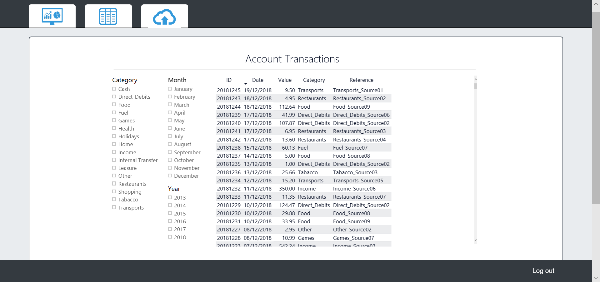
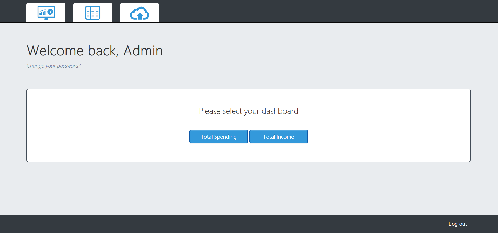
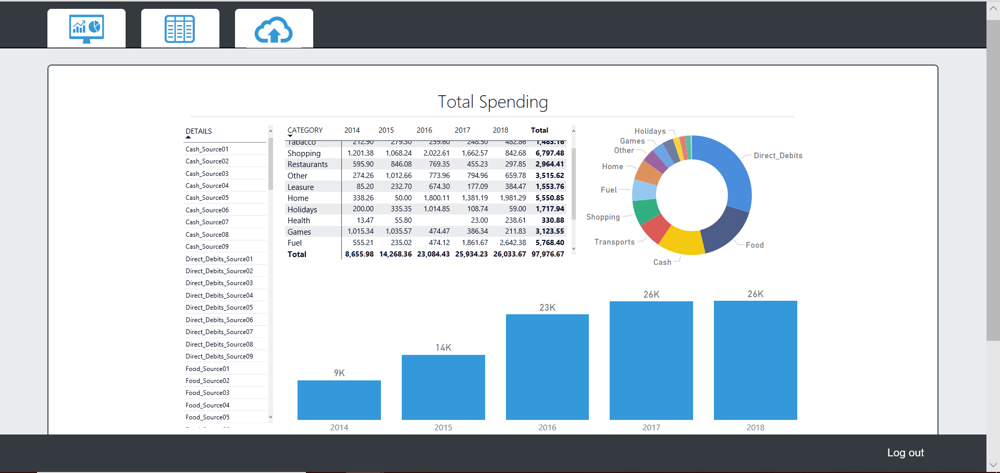
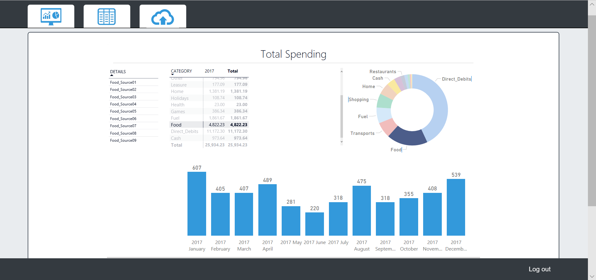

# Bank Statement Analyser

### Overview
This application analyses bank statements and provides analytical reports on the account expenses. 
This is a personal project to get an idea about my expenses and sharpen my knowledge on the following set of technologies :
- Python Flask framework
- Computer Vision (Google's Tesseract OCR)
- Pdf to Image python package (Pdf2image)
- Machine Learning (Scikit Learn) to predict transaction categories
- Azure SQL Database to store transaction data and user login details
- PowerBI visualisations

Behind the scenes, the app extracts transaction details from documents, predicts a category for each transaction, and upload the data to a SQL database linked to interactive PowerBI visualisations.

### Demo
https://bsa-demo.azurewebsites.net/<br/>
Username : admin<br/>
Password : password123
> Visualisations are generated from ~3000 transaction samples which can be viewed in transaction.db

There are three main screens to the application : 
- Transaction details
- Dashboard views
- Statements upload

Transaction details


Dashboard selection screen


Dashboard view (Total spending)


Filtered Dashboard by Year and Category


### Read further to create your own App
#### Initial Setup
The following steps are required to link your own data to the displayed visualisations
- Create a SQL Database with the tables suggested below *
- Replace the database connection variables in parameters.py
- In each PowerBI file (.pbix), set up a DirectQuery to the database
- Upload .pbix files to PowerBI Service and create sharable links (Publish to Web)
- Insert each link in the corresponding html template

#### * SQL Tables :

> A transaction table containing transaction records

```
CREATE TABLE transactions (
    ID varchar(255) NOT NULL PRIMARY KEY,
    Date datetime NOT NULL,
    Value float,
    Category varchar(255),
	Reference varchar(255)
);
```
 
> A users table containing login details

```
CREATE TABLE users (
    id INTEGER NOT NULL PRIMARY KEY Identity(1, 1),
    username VARCHAR(15) UNIQUE,
	email VARCHAR(50) UNIQUE,
	password VARCHAR(80)
);
```
#### Run the app locally
In the command prompt, run the following :
1.	Install Docker
    ```
    $ pip install docker
    ```
2.  Verify Docker installation
    ```
    $ docker version
    ```
3.  cd into the bsa-app folder
    ```
    $ cd full/path/to/bsa-app
    ```
4.	Build docker image
    ```
    $ docker build -t bsa_image:latest .
    ```
5.	Generate and Run a container
    ```
    $ docker run -p 5000:5000 bsa_image:latest
    ```
6.	Visit http://localhost:5000/

